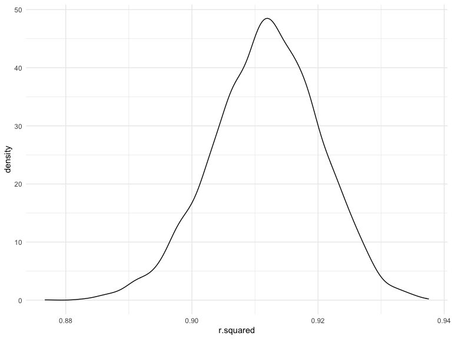
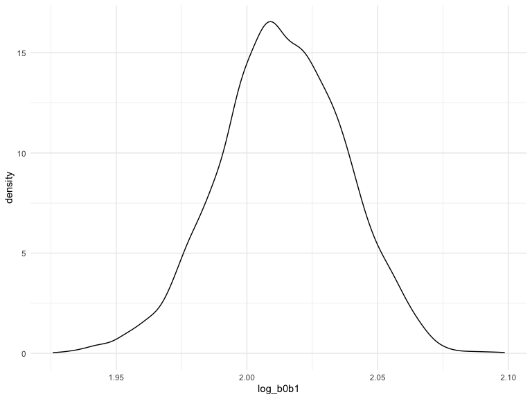

Homework 6
================
Tianyou Wang

## Problem 1 with Given Code - NOAA

### Data Import

``` r
weather_df = 
  rnoaa::meteo_pull_monitors(
    c("USW00094728"),
    var = c("PRCP", "TMIN", "TMAX"), 
    date_min = "2017-01-01",
    date_max = "2017-12-31") %>%
  mutate(
    name = recode(id, USW00094728 = "CentralPark_NY"),
    tmin = tmin / 10,
    tmax = tmax / 10) %>%
  select(name, id, everything())
```

    ## Registered S3 method overwritten by 'hoardr':
    ##   method           from
    ##   print.cache_info httr

    ## using cached file: ~/Library/Caches/R/noaa_ghcnd/USW00094728.dly

    ## date created (size, mb): 2022-09-03 15:53:33 (8.394)

    ## file min/max dates: 1869-01-01 / 2022-09-30

To obtain a distribution for $\hat{r}^2$, we’ll follow basically the
same procedure we used for regression coefficients: draw bootstrap
samples –\> fit the a model to each –\> extract the value I’m concerned
with –\> and summarize. Here, we’ll use `modelr::bootstrap` to draw 5000
bootstrap samples and `broom::glance` to produce `r.squared` values.

### Distribution of $\hat{r}^2$ and its 95% CI

``` r
weather_r2_df = 
  weather_df %>% 
  modelr::bootstrap(n = 5000) %>% 
  mutate(
    models = map(strap, ~lm(tmax ~ tmin, data = .x) ),
    results = map(models, broom::glance)) %>% 
  select(-strap, -models) %>% 
  unnest(results)

weather_r2_df %>% 
  ggplot(aes(x = r.squared)) + 
  geom_density()
```



In this example, the $\hat{r}^2$ value is high, and the upper bound at 1
may be a cause for the generally skewed shape of the distribution. If we
wanted to construct a confidence interval for $R^2$, we could take the
2.5% and 97.5% quantiles of the estimates across bootstrap samples.
However, because the shape isn’t symmetric, using the mean +/- 1.96
times the standard error probably wouldn’t work well.

``` r
weather_r2_df %>% 
  summarize(
    ci_r2_lower = quantile(r.squared, 0.025), 
    ci_r2_upper = quantile(r.squared, 0.975)) %>% 
  knitr::kable(digits = 3)
```

| ci_r2_lower | ci_r2_upper |
|------------:|------------:|
|       0.894 |       0.927 |

### Distribution of $\log(\beta_0 * \beta1)$ and its 95% CI

We can produce a distribution for $\log(\beta_0 * \beta1)$ using a
similar approach, with a bit more wrangling before we make our plot.

``` r
weather_logb0b1_df = 
  weather_df %>% 
  modelr::bootstrap(n = 5000) %>% 
  mutate(
    models = map(strap, ~lm(tmax ~ tmin, data = .x) ),
    results = map(models, broom::tidy)) %>% 
  select(-strap, -models) %>% 
  unnest(results) %>% 
  select(id = `.id`, term, estimate) %>% 
  pivot_wider(
    names_from = term, 
    values_from = estimate) %>% 
  rename(beta0 = `(Intercept)`, beta1 = tmin) %>% 
  mutate(log_b0b1 = log(beta0 * beta1))


weather_logb0b1_df %>% 
  ggplot(aes(x = log_b0b1)) + 
  geom_density()
```



``` r
weather_logb0b1_df %>% 
  summarize(
    ci_logb0b1_lower = quantile(log_b0b1, 0.025), 
    ci_logb0b1_upper = quantile(log_b0b1, 0.975)) %>% 
  knitr::kable(digits = 3)
```

| ci_logb0b1_lower | ci_logb0b1_upper |
|-----------------:|-----------------:|
|            1.966 |            2.059 |

As with $r^2$, this distribution is somewhat skewed and has some
outliers.

The point of this is not to say you should always use the bootstrap –
it’s possible to establish “large sample” distributions for strange
parameters / values / summaries in a lot of cases, and those are great
to have. But it is helpful to know that there’s a way to do inference
even in tough cases.

## Problem 2 - Homicides in US Cities

## Problem 3 - Child Birthweight
