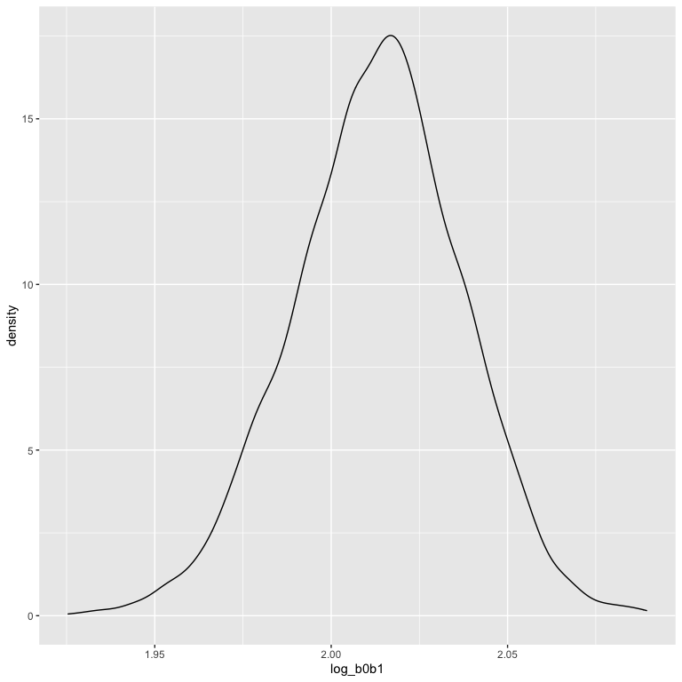
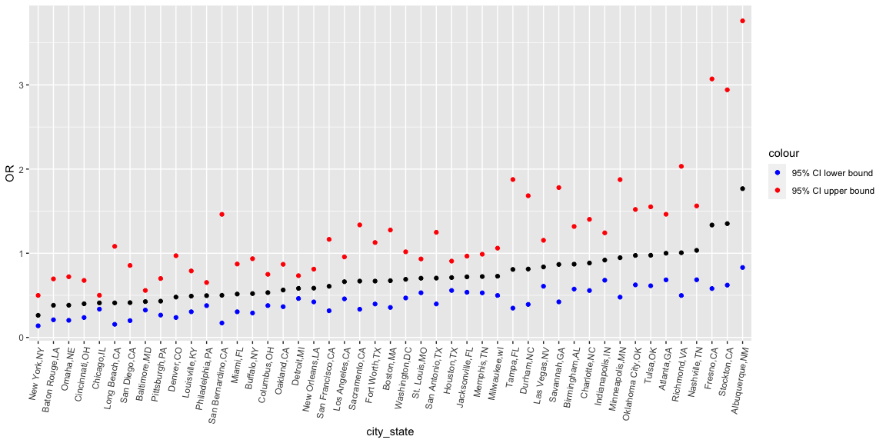
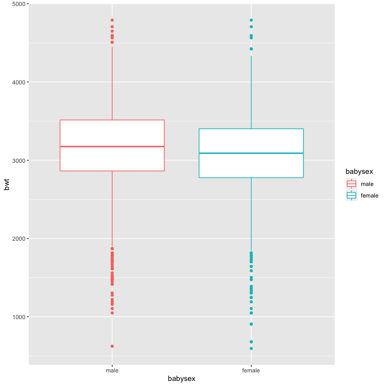
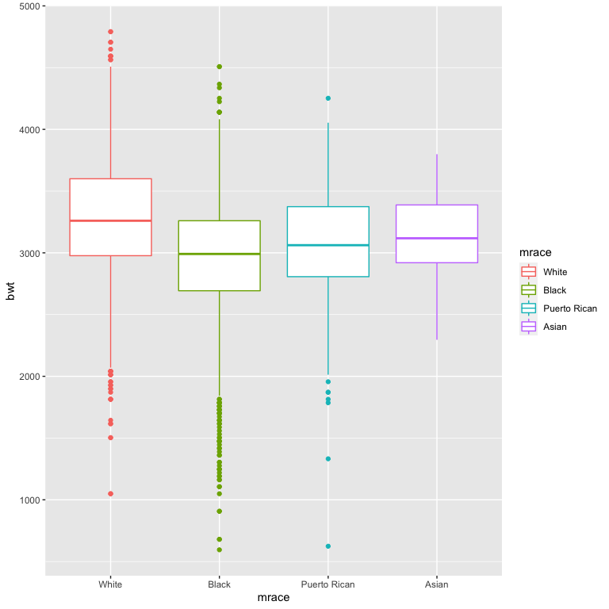

p8105_hw6_tw2838
================
Tianyou Wang

## Problem 1 with Given Code - NOAA

### *Data Import*

``` r
weather_df = 
  rnoaa::meteo_pull_monitors(
    c("USW00094728"),
    var = c("PRCP", "TMIN", "TMAX"), 
    date_min = "2017-01-01",
    date_max = "2017-12-31") %>%
  mutate(
    name = recode(id, USW00094728 = "CentralPark_NY"),
    tmin = tmin / 10,
    tmax = tmax / 10) %>%
  select(name, id, everything())
```

    ## using cached file: ~/Library/Caches/R/noaa_ghcnd/USW00094728.dly

    ## date created (size, mb): 2022-09-03 15:53:33 (8.394)

    ## file min/max dates: 1869-01-01 / 2022-09-30

To obtain a distribution for $\hat{r}^2$, we’ll follow basically the
same procedure we used for regression coefficients: draw bootstrap
samples –\> fit the a model to each –\> extract the value I’m concerned
with –\> and summarize. Here, we’ll use `modelr::bootstrap` to draw 5000
bootstrap samples and `broom::glance` to produce `r.squared` values.

### *Distribution of $\hat{r}^2$ and its 95% CI*

``` r
weather_r2_df = 
  weather_df %>% 
  modelr::bootstrap(n = 5000) %>% 
  mutate(
    models = map(strap, ~lm(tmax ~ tmin, data = .x) ),
    results = map(models, broom::glance)) %>% 
  select(-strap, -models) %>% 
  unnest(results)

weather_r2_df %>% 
  ggplot(aes(x = r.squared)) + 
  geom_density()
```


In this example, the $\hat{r}^2$ value is high, and the upper bound at 1
may be a cause for the generally skewed shape of the distribution. If we
wanted to construct a confidence interval for $R^2$, we could take the
2.5% and 97.5% quantiles of the estimates across bootstrap samples.
However, because the shape isn’t symmetric, using the mean +/- 1.96
times the standard error probably wouldn’t work well.

``` r
weather_r2_df %>% 
  summarize(
    ci_r2_lower = quantile(r.squared, 0.025), 
    ci_r2_upper = quantile(r.squared, 0.975)) %>% 
  knitr::kable(digits = 3)
```

| ci_r2_lower | ci_r2_upper |
|------------:|------------:|
|       0.894 |       0.927 |

### Distribution of $\log(\beta_0 * \beta1)$ and its 95% CI

We can produce a distribution for $\log(\beta_0 * \beta1)$ using a
similar approach, with a bit more wrangling before we make our plot.

``` r
weather_logb0b1_df = 
  weather_df %>% 
  modelr::bootstrap(n = 5000) %>% 
  mutate(
    models = map(strap, ~lm(tmax ~ tmin, data = .x) ),
    results = map(models, broom::tidy)) %>% 
  select(-strap, -models) %>% 
  unnest(results) %>% 
  select(id = `.id`, term, estimate) %>% 
  pivot_wider(
    names_from = term, 
    values_from = estimate) %>% 
  rename(beta0 = `(Intercept)`, beta1 = tmin) %>% 
  mutate(log_b0b1 = log(beta0 * beta1))


weather_logb0b1_df %>% 
  ggplot(aes(x = log_b0b1)) + 
  geom_density()
```



``` r
weather_logb0b1_df %>% 
  summarize(
    ci_logb0b1_lower = quantile(log_b0b1, 0.025), 
    ci_logb0b1_upper = quantile(log_b0b1, 0.975)) %>% 
  knitr::kable(digits = 3)
```

| ci_logb0b1_lower | ci_logb0b1_upper |
|-----------------:|-----------------:|
|            1.964 |            2.057 |

As with $r^2$, this distribution is somewhat skewed and has some
outliers.

The point of this is not to say you should always use the bootstrap –
it’s possible to establish “large sample” distributions for strange
parameters / values / summaries in a lot of cases, and those are great
to have. But it is helpful to know that there’s a way to do inference
even in tough cases.

## Problem 2 - Homicides in US Cities

### *Data Import and Cleanning*

In the following code chunk, I did:

-   Creating a `city_state` variable with combine the information form
    `city` and `state`, eg. Baltimore, MD
-   Creating a binary variable that indicates whether the homicide is
    solved (0 = unsolved; 1 = solved)
-   Omitting cities “Dallas, TX,” “Phoenix, AZ,” “Kansas City, MO,” and
    “Tulsa, AL.” Their data is not complete or correct.
-   Omitting people who is not White or Black
-   Changing `victim_age` into numeric variable. “NA” is assignied
    automatically for unknown ages

``` r
homicide_df = 
  read_csv("data/homicide-data.csv") %>%
  janitor::clean_names() %>% 
  mutate(city_state = str_c(city, state, sep = ","),
         solve_status = ifelse(disposition == "Closed by arrest", 1, 0)) %>% 
  filter(city_state != "Dallas,TX" 
         & city_state != "Phoenix,AZ" 
         & city_state != "Kansas City,MO"
         & city_state != "Tulsa,AL") %>% 
  filter(victim_race == "White" | victim_race == "Black") %>% 
  mutate(victim_age = as.numeric(victim_age)) %>%
  select(city_state, solve_status, victim_race, victim_age, victim_sex)
```

    ## Rows: 52179 Columns: 12
    ## ── Column specification ────────────────────────────────────────────────────────
    ## Delimiter: ","
    ## chr (9): uid, victim_last, victim_first, victim_race, victim_age, victim_sex...
    ## dbl (3): reported_date, lat, lon
    ## 
    ## ℹ Use `spec()` to retrieve the full column specification for this data.
    ## ℹ Specify the column types or set `show_col_types = FALSE` to quiet this message.

### *Fit Logistic Regression via `glm` in Baltimore,MD*

Using the `glm` function with the `family=binomial()` specified to
account for the non-Gaussian outcome distribution.

In the follwing code, I fitted a logistic regression and obtained the
estimate and confidence interval of the adjusted odds ratio for solving
homicides comparing male victims to female victims keeping all other
variables fixed.

``` r
baltimore_df = 
  homicide_df %>% 
  filter(city_state == "Baltimore,MD")

fit_logistic = 
  baltimore_df %>% 
  glm(solve_status ~ victim_age + victim_sex + victim_race, data = ., family = binomial()) %>% 
  broom::tidy() %>% 
  mutate(OR = exp(estimate),
         CI_95_low = exp(estimate - (1.96 * std.error)),
         CI_95_up = exp(estimate + (1.96 * std.error))) %>%
  select(term, OR, CI_95_low, CI_95_up) %>% 
  filter(term == "victim_sexMale") %>% 
  knitr::kable(digits = 3)

fit_logistic
```

| term           |    OR | CI_95_low | CI_95_up |
|:---------------|------:|----------:|---------:|
| victim_sexMale | 0.426 |     0.325 |    0.558 |

### *Fit Logistic Regression via `glm` in all cities*

Now run `glm` for each of the cities in your dataset, and extract the
adjusted odds ratio (and CI) for solving homicides comparing male
victims to female victims. Do this within a “tidy” pipeline, making use
of purrr::map, list columns, and unnest as necessary to create a
dataframe with estimated ORs and CIs for each city.

``` r
homicide_nest = nest(homicide_df, data = solve_status:victim_sex) %>% 
  mutate(
    models = map(data, ~ glm(solve_status ~ victim_age + victim_sex + victim_race, data = ., family = binomial())),
    results = map(models, broom::tidy)) %>% 
  unnest(results) %>% 
  mutate(OR = exp(estimate),
         CI_95_low = exp(estimate - (1.96 * std.error)),
         CI_95_up = exp(estimate + (1.96 * std.error))) %>%
  select(city_state, term, OR, CI_95_low, CI_95_up)

adj_OR_sex =
  homicide_nest %>% 
  filter(term == "victim_sexMale")

adj_OR_sex %>% 
  knitr::kable(digits = 3)
```

| city_state        | term           |    OR | CI_95_low | CI_95_up |
|:------------------|:---------------|------:|----------:|---------:|
| Albuquerque,NM    | victim_sexMale | 1.767 |     0.831 |    3.761 |
| Atlanta,GA        | victim_sexMale | 1.000 |     0.684 |    1.463 |
| Baltimore,MD      | victim_sexMale | 0.426 |     0.325 |    0.558 |
| Baton Rouge,LA    | victim_sexMale | 0.381 |     0.209 |    0.695 |
| Birmingham,AL     | victim_sexMale | 0.870 |     0.574 |    1.318 |
| Boston,MA         | victim_sexMale | 0.674 |     0.356 |    1.276 |
| Buffalo,NY        | victim_sexMale | 0.521 |     0.290 |    0.935 |
| Charlotte,NC      | victim_sexMale | 0.884 |     0.557 |    1.403 |
| Chicago,IL        | victim_sexMale | 0.410 |     0.336 |    0.501 |
| Cincinnati,OH     | victim_sexMale | 0.400 |     0.236 |    0.677 |
| Columbus,OH       | victim_sexMale | 0.532 |     0.378 |    0.750 |
| Denver,CO         | victim_sexMale | 0.479 |     0.236 |    0.971 |
| Detroit,MI        | victim_sexMale | 0.582 |     0.462 |    0.734 |
| Durham,NC         | victim_sexMale | 0.812 |     0.392 |    1.683 |
| Fort Worth,TX     | victim_sexMale | 0.669 |     0.397 |    1.127 |
| Fresno,CA         | victim_sexMale | 1.335 |     0.580 |    3.071 |
| Houston,TX        | victim_sexMale | 0.711 |     0.558 |    0.907 |
| Indianapolis,IN   | victim_sexMale | 0.919 |     0.679 |    1.242 |
| Jacksonville,FL   | victim_sexMale | 0.720 |     0.537 |    0.966 |
| Las Vegas,NV      | victim_sexMale | 0.837 |     0.608 |    1.154 |
| Long Beach,CA     | victim_sexMale | 0.410 |     0.156 |    1.082 |
| Los Angeles,CA    | victim_sexMale | 0.662 |     0.458 |    0.956 |
| Louisville,KY     | victim_sexMale | 0.491 |     0.305 |    0.790 |
| Memphis,TN        | victim_sexMale | 0.723 |     0.529 |    0.988 |
| Miami,FL          | victim_sexMale | 0.515 |     0.304 |    0.872 |
| Milwaukee,wI      | victim_sexMale | 0.727 |     0.499 |    1.060 |
| Minneapolis,MN    | victim_sexMale | 0.947 |     0.478 |    1.875 |
| Nashville,TN      | victim_sexMale | 1.034 |     0.685 |    1.562 |
| New Orleans,LA    | victim_sexMale | 0.585 |     0.422 |    0.811 |
| New York,NY       | victim_sexMale | 0.262 |     0.138 |    0.499 |
| Oakland,CA        | victim_sexMale | 0.563 |     0.365 |    0.868 |
| Oklahoma City,OK  | victim_sexMale | 0.974 |     0.624 |    1.520 |
| Omaha,NE          | victim_sexMale | 0.382 |     0.203 |    0.721 |
| Philadelphia,PA   | victim_sexMale | 0.496 |     0.378 |    0.652 |
| Pittsburgh,PA     | victim_sexMale | 0.431 |     0.265 |    0.700 |
| Richmond,VA       | victim_sexMale | 1.006 |     0.498 |    2.033 |
| San Antonio,TX    | victim_sexMale | 0.705 |     0.398 |    1.249 |
| Sacramento,CA     | victim_sexMale | 0.669 |     0.335 |    1.337 |
| Savannah,GA       | victim_sexMale | 0.867 |     0.422 |    1.780 |
| San Bernardino,CA | victim_sexMale | 0.500 |     0.171 |    1.462 |
| San Diego,CA      | victim_sexMale | 0.413 |     0.200 |    0.855 |
| San Francisco,CA  | victim_sexMale | 0.608 |     0.317 |    1.165 |
| St. Louis,MO      | victim_sexMale | 0.703 |     0.530 |    0.932 |
| Stockton,CA       | victim_sexMale | 1.352 |     0.621 |    2.942 |
| Tampa,FL          | victim_sexMale | 0.808 |     0.348 |    1.876 |
| Tulsa,OK          | victim_sexMale | 0.976 |     0.614 |    1.552 |
| Washington,DC     | victim_sexMale | 0.690 |     0.468 |    1.017 |

### *Plot of Estimated Adjusted ORs and CIs among Cities*

``` r
plot_1 = 
  adj_OR_sex %>% 
  mutate(city_state = fct_reorder(city_state, OR)) %>% 
  ggplot(aes(x = city_state, y = OR)) + 
  geom_point() + 
  geom_point(data = adj_OR_sex, mapping = (aes(x = city_state, y = CI_95_low, color = "blue"))) +
  geom_point(data = adj_OR_sex, mapping = (aes(x = city_state, y = CI_95_up, color = "red"))) +
  theme(axis.text.x = element_text(angle = 80, hjust = 1)) +
  scale_color_manual(values = c("blue", "red"),
                     labels = c("95% CI lower bound",
                                "95% CI upper bound"))

plot_1
```



## Problem 3 - Child Birth Weight

### *Data Import and Cleanning*

``` r
bw_df = read_csv("./data/birthweight.csv") %>% 
  janitor::clean_names() %>% 
  mutate(babysex = ifelse(babysex == 1, "male", "female"),
         babysex = fct_infreq(babysex),
         frace = case_when(frace == 1 ~ "White", 
                           frace == 2 ~ "Black",
                           frace == 3 ~ "Asian",
                           frace == 4 ~ "Puerto Rican",
                           frace == 8 ~ "Other", 
                           frace == 9 ~ "Unknown"),
         frace = fct_infreq(frace),
         mrace = case_when(mrace == 1 ~ "White", 
                           mrace == 2 ~ "Black",
                           mrace == 3 ~ "Asian",
                           mrace == 4 ~ "Puerto Rican",
                           mrace == 8 ~ "Other"),
         mrace = fct_infreq(mrace),
         malform = as.character(malform))
```

    ## Rows: 4342 Columns: 20
    ## ── Column specification ────────────────────────────────────────────────────────
    ## Delimiter: ","
    ## dbl (20): babysex, bhead, blength, bwt, delwt, fincome, frace, gaweeks, malf...
    ## 
    ## ℹ Use `spec()` to retrieve the full column specification for this data.
    ## ℹ Specify the column types or set `show_col_types = FALSE` to quiet this message.

Let’s look at missing data in this data set.

``` r
miss_df = 
  bw_df %>% 
  filter(bhead == 0 | blength == 0 | bwt == 0 | delwt == 0 | fincome == 0 
         | frace == "Unknown" | gaweeks == 0 | menarche == 0 | mheight == 0
         | momage == 0 | ppbmi == 0 | ppwt == 0 | wtgain == 0)
```

There are a total of 21 observations that contain missing data.

To simplify the analysis process, I will just drop these 21 observations
since the size of missing data is very small compared to the original
data set.

``` r
bw_clean_df = anti_join(bw_df, miss_df)
```

    ## Joining, by = c("babysex", "bhead", "blength", "bwt", "delwt", "fincome",
    ## "frace", "gaweeks", "malform", "menarche", "mheight", "momage", "mrace",
    ## "parity", "pnumlbw", "pnumsga", "ppbmi", "ppwt", "smoken", "wtgain")

### *Fit Linear Regression Model*

#### **Explore the relationships: t-test**

First, I will fit all main effects in a linear regression model and run
the default t-test to see if the association is significant via
`broom::tidy()`.

``` r
fit = lm(bwt ~ babysex + bhead + blength + delwt + fincome + frace + gaweeks + malform + menarche + mheight + momage + mrace + parity + pnumlbw + pnumsga + ppbmi + ppwt + smoken + wtgain, data = bw_clean_df)

broom::tidy(fit) %>% 
knitr::kable(digits = 3)
```

| term              |  estimate | std.error | statistic | p.value |
|:------------------|----------:|----------:|----------:|--------:|
| (Intercept)       | -6197.310 |   662.020 |    -9.361 |   0.000 |
| babysexfemale     |    29.215 |     8.485 |     3.443 |   0.001 |
| bhead             |   130.991 |     3.462 |    37.834 |   0.000 |
| blength           |    74.833 |     2.025 |    36.957 |   0.000 |
| delwt             |     3.966 |     0.398 |     9.958 |   0.000 |
| fincome           |     0.249 |     0.180 |     1.381 |   0.167 |
| fraceBlack        |    13.902 |    46.133 |     0.301 |   0.763 |
| fracePuerto Rican |   -47.383 |    44.661 |    -1.061 |   0.289 |
| fraceAsian        |    20.874 |    69.267 |     0.301 |   0.763 |
| fraceOther        |     2.762 |    74.046 |     0.037 |   0.970 |
| gaweeks           |    11.535 |     1.467 |     7.864 |   0.000 |
| malform1          |     9.106 |    70.597 |     0.129 |   0.897 |
| menarche          |    -4.333 |     2.925 |    -1.481 |   0.139 |
| mheight           |     8.909 |    10.334 |     0.862 |   0.389 |
| momage            |     0.757 |     1.225 |     0.618 |   0.537 |
| mraceBlack        |  -151.560 |    46.027 |    -3.293 |   0.001 |
| mracePuerto Rican |   -57.443 |    45.122 |    -1.273 |   0.203 |
| mraceAsian        |   -90.910 |    71.890 |    -1.265 |   0.206 |
| parity            |    95.399 |    40.463 |     2.358 |   0.018 |
| pnumlbw           |        NA |        NA |        NA |      NA |
| pnumsga           |        NA |        NA |        NA |      NA |
| ppbmi             |     2.868 |    14.927 |     0.192 |   0.848 |
| ppwt              |    -3.057 |     2.620 |    -1.167 |   0.243 |
| smoken            |    -4.830 |     0.588 |    -8.209 |   0.000 |
| wtgain            |        NA |        NA |        NA |      NA |

Based on t-test, at the 5% significance level, `babysex`, `bhead`,
`blength`, `delwt`, `gaweeks`, `mrace(Black)`, and `smoken` have
significant association with birthweight.

Since `mrace` is a categorical variable that have more than 2 levels, I
will perform an ANOVA test to test them together.

``` r
fit_null = lm(bwt ~ babysex + bhead + blength + delwt + fincome + frace + gaweeks + malform + menarche + mheight + momage + parity + pnumlbw + pnumsga + ppbmi + ppwt + smoken + wtgain, data = bw_clean_df)

fit_alt = lm(bwt ~ babysex + bhead + blength + delwt + fincome + frace + gaweeks + malform + menarche + mheight + momage + mrace + parity + pnumlbw + pnumsga + ppbmi + ppwt + smoken + wtgain, data = bw_clean_df)

anova(fit_null, fit_alt) %>% 
  pull("Pr(>F)")
```

    ## [1]          NA 0.008461635

Since the Pr(\>F) = NA, 0.0084616 \< 0.05, there is evidence to show
that there a significant association between `mrace` and birthweight.

#### **Visualization**

Visualize relationships between birthweight and some variables,
including `babysex`, `bhead`, `blength`, `delwt`, `gaweeks`, `mrace`,
and `smoken`, through correlation and boxplots.

##### *Correlation for Continuous Variable*

``` r
library("PerformanceAnalytics")
```

    ## Loading required package: xts

    ## Loading required package: zoo

    ## 
    ## Attaching package: 'zoo'

    ## The following objects are masked from 'package:base':
    ## 
    ##     as.Date, as.Date.numeric

    ## 
    ## Attaching package: 'xts'

    ## The following objects are masked from 'package:dplyr':
    ## 
    ##     first, last

    ## 
    ## Attaching package: 'PerformanceAnalytics'

    ## The following object is masked from 'package:graphics':
    ## 
    ##     legend

Checking correlation among `bwt`, `bhead`, `blength`, `delwt`,
`gaweeks`, and `smoken`.

``` r
corr_df = 
  bw_clean_df %>% 
  select(bwt, bhead, blength, delwt, gaweeks, smoken) %>%
  chart.Correlation(histogram = TRUE)
```


According to the correlation coefficient, there is no pair of interested
co-variables that are highly correlated (\> 0.8). So we can include all
co-variables in the final model. All `bhead` (baby’s head circumference
at birth), `blength` (baby’s length at birth), `delwt` (mother’s weight
at delivery), and `gaweeks` (gestational age in weeks) are positively
correlated with `bwt` (baby’s birth weight). However, `smoken` (average
number of cigarettes smoked per day during pregnancy), smoking
negatively correlates with `bwt`.

##### *Boxplot for Categorical Variables*

1.  birthweight and `babysex`

``` r
bw_clean_df %>% 
  ggplot(aes(x = babysex, y = bwt, color = babysex)) +
  geom_boxplot()
```



Comparing birthweight among sex groups, grils have lower mean
birthweight, lower 25% quartile, and lower 75% quartile than boys. Both
groups have more extreme low birthweight than extreme high birthweight.
However, more girls have extreme low birthweight.

2.  birthweight and `mrace`

``` r
bw_clean_df %>% 
  ggplot(aes(x = mrace, y = bwt, color = mrace)) +
  geom_boxplot()
```



Comparing among mothers’ race groups, for Black mothers, their kids
turned to have much lower birthweight, lower 25% quartile, and lower 75%
quartile than other kids whose mothers are not Black. Black mothers also
turn to give birth to kids who have extreme low birthweight.

In conclusion, since the birth weight distributions are so different
among sex groups and mothers’ race groups, we will include both
`babysex` and `mrace` in the linear regression model.

#### **Final proposed model**

Finally, I propose the model for birthweight as a linear regression
model which include `babysex` (baby’s sex), `bhead` (baby’s head
circumference at birth), `blength` (baby’s length at birth), `delwt`
(mother’s weight at delivery), `gaweeks` (gestational age in weeks),
`mrace` (mother’s race), `smoken` (average number of cigarettes smoked
per day during pregnancy) as predicting variables.

``` r
fit_final = lm(bwt ~ babysex + bhead + blength + delwt + gaweeks + mrace + smoken, data = bw_clean_df)

broom::tidy(fit_final) %>% 
knitr::kable(digits = 3)
```

| term              |  estimate | std.error | statistic | p.value |
|:------------------|----------:|----------:|----------:|--------:|
| (Intercept)       | -5808.013 |    99.033 |   -58.647 |   0.000 |
| babysexfemale     |    29.959 |     8.513 |     3.519 |   0.000 |
| bhead             |   131.930 |     3.470 |    38.016 |   0.000 |
| blength           |    75.696 |     2.024 |    37.404 |   0.000 |
| delwt             |     2.265 |     0.197 |    11.499 |   0.000 |
| gaweeks           |    11.805 |     1.463 |     8.071 |   0.000 |
| mraceBlack        |  -146.918 |     9.257 |   -15.872 |   0.000 |
| mracePuerto Rican |  -121.295 |    18.766 |    -6.464 |   0.000 |
| mraceAsian        |   -72.681 |    42.470 |    -1.711 |   0.087 |
| smoken            |    -4.725 |     0.590 |    -8.014 |   0.000 |

### *Plot of Model Residuals*

``` r
plot_2 = 
bw_clean_df %>% 
  modelr::add_residuals(fit_final) %>%
  modelr::add_predictions(fit_final) %>% 
  select(pred, resid, bwt) %>% 
  ggplot(aes(x = pred, y = resid)) + 
  geom_point(alpha = .3, size = 1) + 
  labs(x = "Fitted Value", 
       y = "Model Residual")
  
plot_2
```


The model residuals kind of follw a normal distribution, which is part
of the linear regression assumption.

### *Model Comparison*

Fit each candidate model to the cleaned dataset.

``` r
fit_my = fit_final

fit_1 = lm(bwt ~ blength + gaweeks, data = bw_clean_df)

fit_2 = lm(bwt ~ bhead + blength + babysex + bhead*blength + bhead*babysex + blength*babysex + bhead*blength*babysex, data = bw_clean_df)
```

Using `crossv_mc` to preforms the training/testing split multiple times,
and stores the datasets using list columns.

``` r
bw_clean_df2 = 
  bw_clean_df %>% 
  select(bwt, babysex, bhead, blength, delwt, gaweeks, mrace, smoken)

cv_df =
  crossv_mc(bw_clean_df2, 100) %>% 
  mutate(
    train = map(train, as_tibble),
    test = map(test, as_tibble)) %>% 
  mutate(
    fit_my  = map(train, ~lm(bwt ~ babysex + bhead + blength + delwt + gaweeks + mrace + smoken, data = .x)),
    fit_1     = map(train, ~lm(bwt ~ blength + gaweeks, data = .x)),
    fit_2  = map(train, ~lm(bwt ~ bhead + blength + babysex + bhead*blength + bhead*babysex + blength*babysex + bhead*blength*babysex, data = .x))) %>% 
  mutate(
    rmse_my = map2_dbl(fit_my, test, ~rmse(model = .x, data = .y)),
    rmse_1    = map2_dbl(fit_1, test, ~rmse(model = .x, data = .y)),
    rmse_2 = map2_dbl(fit_2, test, ~rmse(model = .x, data = .y)))
```

#### **Plot the prediction error distribution for each models**

``` r
cv_df %>% 
  select(starts_with("rmse")) %>% 
  pivot_longer(
    everything(),
    names_to = "model", 
    values_to = "rmse",
    names_prefix = "rmse_") %>% 
  mutate(model = fct_inorder(model)) %>% 
  ggplot(aes(x = model, y = rmse, color = model)) + 
  geom_violin()
```


Based on these results, all the model have high RMSEs. However, my model
has a reletively better prediction accuracy than the given two models.
